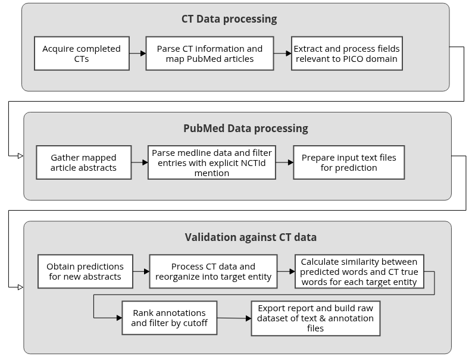

# CTPICO wf - Workflow to perform datasets augmentation for PICO NER experiments

Nextflow workflow to perform automatic dataset augmention of a specific set of named entities named PICO (standing for participants, intervention, control and outcomes), gathering and cross-referencing data from ClinicalTrials (CTs) ncbi API and Pubmed abstracts. 

<div style="text-align: center">
	
</div>

## Summary

We have developed a workflow with two main modules: (1.1) Acquire/Process up to date completed CTs raw data and validate the presence of the main information required for the entities validation; (1.2) Gather/process pubmed abstracts directly linked  in the raw CT structured files; (2) Validation by confronting and testing pairwise similarity between the prediction annotations per PICO-domain entity from NER Fair workflow output and the items extracted for each entity in the clinical trial associated with the respective pubmed ID. At the end, it generates the table with the similarity scores for the annotations and also a folder containing \*.ann and \*.txt ready to serve as input to the NER Fair workflow for training a new model.

## Requirements:
* The packages are stated in the environment's exported file: environment.yml

## Usage Instructions
### Preparation:
1. ````git clone https://github.com/YasCoMa/pico_augmentation_workflow.git````
2. ````cdpico_augmentation_workflow````
3. ````conda env create --file environment.yml````
4. The workflow requires four parameters, you can edit them in main.nf, or pass in the command line when you start the execution. The parameters are:
	- **mode**: Indicates the goal of the workflow: 'preprocess' or 'validation'. It activates accordingly the steps according to the mode.
	- **dataDir**: The directory where the execution logs will be stored together with the marker files to track the modules already executed.
	- **runningConfig**: A json file with the configuration setup desired by the user. Each main key/parameter of the json file is explained below.
		- **outpath**: Path to the directory where the workflow modules will store the results. Mandatory. Example: ``./validation_ctpico_out``

		- **config_hpc**: Path to the json file containing the cluster access information to launch jobs. Check more details about it in the "HPC execution configuration" section.  Example: ``./config_hpc.json``

		- [Only validation mode] **path_prediction_result**: Path to the prediction folder after applying a trained model in nerfair workflow to the prepared texts frm the pre-processing module of CTPICO wokflow. Mandatory for validation step. Example: ``./nerwf_out_out/expIdentifier-pretrainedModel-finetuned-ner/prediction/``

		- [Only validation mode] **cutoff_consensus**: Cutoff to choose the top ranked annotations based on the similarity score with the clinical trial items. These top ranked entries will be used to generate the final .ann and .txt files that may enter to train a new model. Default value: 0.8.


### Run workflow:
1. Examples of running configuration are shown in running_config.json and eskape_running_config.json

2. Modes of execution:
	- **Run Pre-processing:**
		- ````nextflow run main.nf --dataDir /path/to/output_logs --runningConfig /path/to/validation_config.json --mode preprocess ````
		- This module will generate a folder named "input_prediction" that can be configured in the "input_prediction" parameter of the ner fair workflow configuration file. After running it in the prediction mode, you can look for the prediction results path in the working directory you assigned by the "outpath" parameter.
		The path to the prediction folder must be configured in the CTPICO wf configuration file in the "path_prediction_result" parameter.
	- **Run Validation:**
		- ````nextflow run main.nf --dataDir /path/to/output_logs --runningConfig /path/to/validation_config.json --mode validation ````

### Creating singularity image:
Alternatively, you can run the workflow inside a singularity image. In the container folder you will find the recipe (nermatchct.def) with the instructions to build the image. In this folder you will also find the setup.sh execution file that builds the sand box and the final image file.
You only need to change the variable LOCAL_REPO in line 6 of setup.sh to assign the full path to the container folder. Then you just have to run it:
 ````cd container/````
 ````./setup.sh````

### HPC execution configuration:
Although the workflow steps can be executed completely in a sequential mode. If you associate an HPC configuration file path in the running setup file using the "config_hpc" parameter, some sub steps will distribute tasks to array jobs and the execution time may decrease significantly depending on the amount of inut data.

There is an example of such hpc config. file (config_hpc.json) in this repository, and you have to configure its parameters. It needs all the parameters already structured in the example file, you just have to change following terms on it:
- \_tmpDir\_ : temporary directory path
- \_pathToImage\_ : path to the .simg file corresponding to the singularity image that was built following the instructions of the previous section
- \_hpcEnv\_ : type of hpc environment of the server (it expects either sge or slurm)
- \_hostIp\_ : IP address of the server/head node
- \_sshUser\_ : authentication user
- \_sshPass\_ : authentication password
- \_queueId\_ : queue identifier, if applicable
- \_nodeList\_ : specific nodes to which you want to send the job to compute, if applicable
- \_partition\_ : specific nodes partition, if applicable

For those terms that you want to leave empty just remove the replacer and let it as "''"
The build of the singularity image is mandatory to use the workflow in a cluster.

## Reference
A complete report applying this tool in experiments can be found at https://github.com/YasCoMa/ner-fair-workflow/tree/master/experiment_report 

## Bug Report
Please, use the [Issues](https://github.com/YasCoMa/pico_augmentation_workflow/issues) tab to report any bug.
